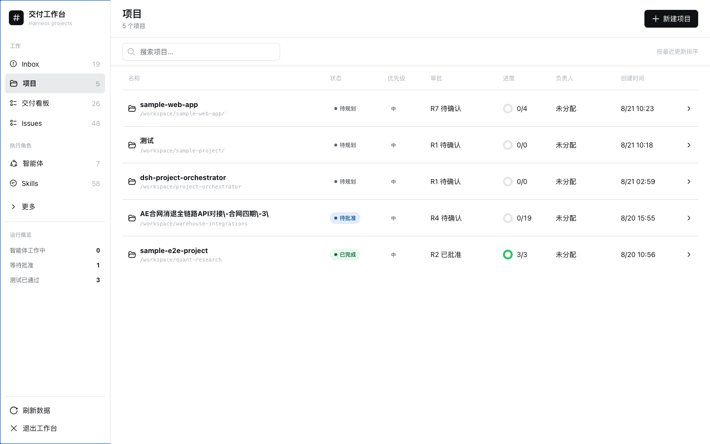
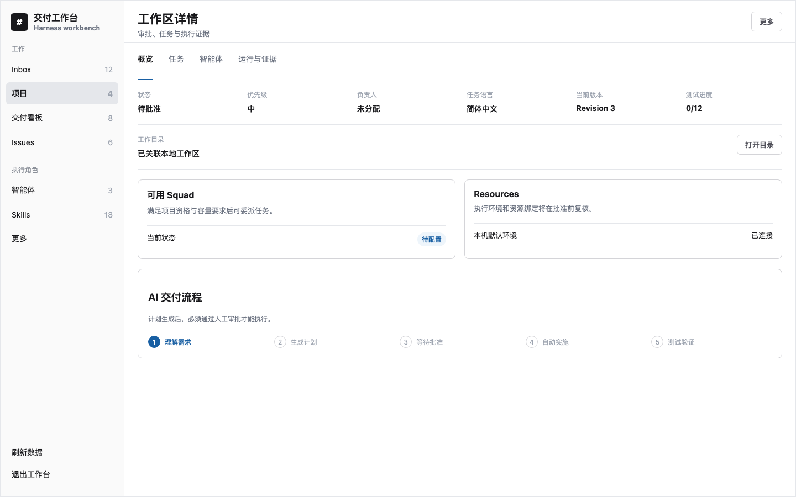
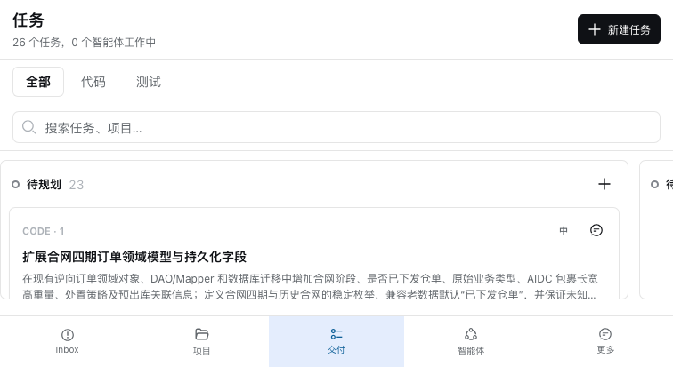

# dsh-project-orchestrator

English | [简体中文](README.zh-CN.md)

A **DeepSeek Harness plugin** for local-first AI project management and task orchestration: approval-gated planning, isolated Git worktrees, human-in-the-loop review, and auditable execution evidence.

`dsh-project-orchestrator` adds a Host service, responsive Web workbench, and loopback CLI to one existing Harness installation. It turns delivery briefs and GitHub Issues into reviewable Tasks, TaskRuns, and evidence while keeping Projects, Decisions, Agent capacity, Git worktree state, Transcripts, Artifacts, and automation receipts in one auditable local workflow.

**Use this when** you want a local DeepSeek Harness workflow for planning coding tasks, importing GitHub Issues, executing in isolated Git worktrees, and requiring human approval before repository changes.

> **Compatibility:** v1.5.8 is certified only with DeepSeek Harness `0.1.0-rc.6`, Cordis `4.0.1`, Node.js 22+, and Git. Future Harness release candidates are not covered until tested.

## See it in action

The plugin lives inside the existing Harness Web shell. The following neutral UI illustrations show the main workflow without exposing any repository, project, path, URL, or user workspace data: approval and progress scanning, execution context, and task delivery stages.

<p align="center">
  
</p>

<p align="center"><em>Illustration: scan status, approval revision, progress, owner, and workspace association in one list.</em></p>

<p align="center">
  
</p>

<p align="center"><em>Illustration: keep workspace association, Resources, Squad readiness, and the approval-bound AI flow in one view.</em></p>

<p align="center">
  
</p>

<p align="center"><em>Illustration: make approval-aware work visible across planning, queued, active, review, and completed stages.</em></p>

```text
Brief or GitHub Issues -> read-only planning -> reviewable Tasks
                                      |
                                      v
                              human approval gate
                                      |
                                      v
                 isolated worktree -> TaskRun -> tests, commits, artifacts, transcript
```

## DeepSeek Harness plugin capabilities

- **AI coding agent orchestration:** plan delivery work into dependency-aware code and test Tasks, then track TaskRuns and verification evidence.
- **Approval-gated AI planning:** human approval is required before execution or repository changes.
- **GitHub Issues and local repositories:** import selected Issues or work from an existing local repository.
- **Git worktree isolation:** execute with bounded diffs, commit evidence, cleanup records, and workspace leases.
- **Human-in-the-loop delivery:** review Issues, make Decisions, coordinate Squad delegation, and inspect Transcripts and Artifacts.
- **CLI and Web workbench:** use the responsive Harness Web UI or the loopback-only CLI against the same local service.

## AI project planning and task orchestration

The Web client defaults to **Empty Project**. It records the Project name and existing working directory without reading the repository, invoking a Planner, creating Tasks, or creating an approval. Add Tasks manually, or add a delivery brief later and explicitly request AI decomposition.

### Code sources

Project creation supports two code-source modes:

- **Local repository:** click **Choose directory** to use the Host's native chooser or in-app directory browser. The Host revalidates the selected existing absolute directory. After creation, the Project automatically creates or reuses the same-path DeepSeek Harness Workspace and persists that association.
- **GitHub repository:** enter a credential-free `https://github.com/owner/repository` URL, page through its branches and open Issues, and choose the branch to pull. Creation shallow-clones that branch into a Harness-managed directory and imports selected Issues into the Project; collections beyond the safety limit fail explicitly instead of being silently truncated. Set `GITHUB_TOKEN` or `GH_TOKEN` to increase GitHub API access limits.

Selected Issues are stored as durable Project Issues. In AI mode, their content is used as the Planner brief when no separate delivery brief is supplied. Empty Projects still do not invoke AI.

Choose **AI decomposition** only when a delivery brief is ready. Planning inspects the repository read-only, generates code and test Tasks, and still requires explicit human approval before execution. After a plan is generated, use **Add requirement and decompose** to submit another requirement document. Each batch keeps its own requirement and Planner session while appending tasks to the same approval-bound Project plan. A Project with execution history cannot be changed by another decomposition batch.

The Project detail view can open the persisted working directory in Finder on macOS or the system file manager through `xdg-open` on Linux. It can also open the associated DeepSeek Harness Workspace. For GitHub sources, that Workspace points to the actual shallow-clone directory for the selected branch, not the GitHub URL. Harness reuses an existing session in that Workspace when possible and creates a blank session only when needed; opening a Project does not create a new session every time. The Host accepts only a Project ID for these actions; Windows is not certified.

## Highlights

- **Explicit AI planning:** Project creation and AI decomposition are separate actions; an empty Project is the Web default.
- **Approval-gated delivery:** AI planning produces a revision/hash-bound plan; execution starts only after explicit approval.
- **Project Agent membership:** reusable workspace Agents explicitly join a Project with a local role and planning eligibility before they can be assigned to its Tasks or Issues.
- **Durable Issue execution:** assignment, reassign, stop, continue, review, and Decision requests converge on idempotent Command records.
- **Runtime and capacity controls:** a visible default Host, managed local Runtime lifecycle and bindings, heartbeat health, Agent `maxConcurrency`, queue retention, restart recovery, directory locks, and workspace leases.
- **Real Git isolation:** fail-closed worktree creation, deterministic branches, base/head commits, bounded diffs, Artifacts, and cleanup evidence.
- **Human collaboration:** Inbox, review gates, comments, Activity, reusable Squads, project eligibility, delegated child Issues, global delegation capacity, and Leader continuation.
- **Auditable automation:** bounded Autopilot, external-trigger deduplication, loopback CLI, Transcript redaction, and explicit unknown token/cost facts.
- **Responsive workbench:** Inbox, Issues, Projects, Delivery Board, Agents, Skills, full Squad/Runtime management, binding impact review, and local-data visibility inside the existing Harness Web shell.
- **Project environment discovery:** approved commands use `<project>/.venv` when present and record the resolved execution environment.
- **Chinese-first planning:** new Projects default to Simplified Chinese human-facing tasks, can opt into English, and can regenerate an unexecuted plan in Chinese with fresh approval required.

## Install

Install pnpm first because the Harness profile plugin manager owns and supplies the required Host peers, then add the npm package. Do not install this plugin as a standalone application with npm peer auto-resolution; Harness `0.1.0-rc.6` packages expose prerelease transitive peer ranges that can otherwise resolve a mixed RC tree.

```bash
npm install --global pnpm
dsh plugin --profile web add dsh-project-orchestrator@1.5.8
```

Add the plugin to the Web profile loader patch, normally `~/.dsh/profiles/web/cordis.patch.yml`:

```yaml
- id: project-orchestrator
  name: dsh-project-orchestrator
```

Restart the existing `dsh web` process and refresh its current URL. Do not run a second Web server for the same profile.

Verify the Host half:

```bash
curl --fail http://127.0.0.1:3080/project-orchestrator/api/health
```

The launcher appears in the Harness sidebar footer. Continue with the [Quickstart](docs/quickstart.md) to create an Agent, plan a Project, approve execution, and inspect TaskRun evidence.

## CLI

The packaged CLI calls the same loopback API as the Web client and refuses non-loopback URLs:

```bash
dsh-project-orchestrator --help
dsh-project-orchestrator snapshot
dsh-project-orchestrator inbox
dsh-project-orchestrator stats
dsh-project-orchestrator command '{"type":"autopilot_tick","actorType":"human","payload":{"agentId":"...","limit":10}}'
```

Override the local API only when the Harness still listens on loopback:

```bash
DSH_PROJECT_ORCHESTRATOR_URL=http://127.0.0.1:3080/project-orchestrator/api \
  dsh-project-orchestrator stats
```

## Execution model

1. A Project owns the approved plan, Resources, lead Agent, and eligible Project Agent memberships.
2. Every approved Task binds an explicit active Project Agent; membership alone never implies execution assignment.
3. An Issue owns assignment, lifecycle, review state, and its active TaskRun pointer.
4. A TaskRun owns one queue/execution attempt and its evidence.
5. A Runtime controls local dispatch eligibility; an Agent contributes capacity.
6. A worktree or in-place lease is acquired before execution.
7. Harness Session events are projected into bounded redacted Transcript entries.
8. Workspace cleanup and evidence settle before a TaskRun becomes terminal.
9. Human review approval is the only Issue completion path.

Runtime records are local Harness Host facts. v1.5.4 does **not** provide remote Agent execution, active/active Hosts, distributed locks, remote branch push, or provider-authenticated pull-request creation.

## Security model

- Mutations require a loopback peer, loopback Host, a matching `Origin`, and same-origin fetch metadata.
- The CLI accepts loopback URLs only.
- Credential-shaped environment variables are removed from child processes.
- Transcript projection is bounded and applies best-effort credential-shaped text redaction.
- Approved test commands intentionally execute through the platform shell. Agents with full tool policy can modify the selected workspace.

Read [SECURITY.md](SECURITY.md) before using the plugin with sensitive repositories. Use a dedicated OS account or stronger sandbox when repository trust is uncertain.

## Storage and recovery

The storage domain is `project_orchestrator`; a standard local profile currently persists it under `~/.dsh/storages/project_orchestrator.json`. Back up that file while Harness is stopped before upgrades or destructive maintenance.

Storage version 1 preserves missing newer tables as empty compatibility tables. Forward migration is supported within the v1 line; downgrade safety is not guaranteed. See [docs/operations.md](docs/operations.md).

## Development

```bash
corepack enable
pnpm install --frozen-lockfile
pnpm verify
```

Useful commands:

```bash
pnpm typecheck
pnpm docs:check
pnpm test
pnpm build
pnpm smoke:package
```

The package smoke test builds the exact npm artifact, checks its file allowlist and executable mode, installs it in a clean temporary project, exercises CLI help/version, and rejects source maps containing absolute home paths.

## Documentation

- [Architecture and source-of-truth rules](docs/architecture.md)
- [Quickstart](docs/quickstart.md)
- [HTTP and CLI contracts](docs/api.md)
- [Compatibility and stability policy](docs/compatibility.md)
- [Operations, backup, upgrade, and rollback](docs/operations.md)
- [Migration from local or scoped builds](docs/migration.md)
- [Maintainer release runbook](docs/releasing.md)
- [Contributing](CONTRIBUTING.md)
- [Security policy](SECURITY.md)
- [Support policy](SUPPORT.md)
- [Governance](GOVERNANCE.md)
- [Code of Conduct](CODE_OF_CONDUCT.md)
- [Changelog](CHANGELOG.md)

## Buy the author a coffee

If this project helps you, you can support its continued maintenance with WeChat Pay or Alipay. Thank you for your support.

<p align="center">
  
</p>

## Project status and affiliation

This is an independent community plugin and is not an official DeepSeek or DeepSeek Harness project. DeepSeek and related names may be trademarks of their respective owners.

## License

[MIT](LICENSE) © 2026 zhangz-2018
