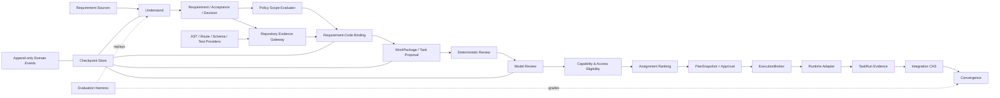

# 证据驱动任务规划工程优化方案

> 评估基线：`dsh-project-orchestrator` 1.7.0 工作区，2026-09-06
>
> 对标范围：Multica、OpenHands、LangGraph、Aider、SWE-agent/SWE-bench、AutoGen
>
> 文档性质：工程改进方案。实施进度和未通过的发布门禁见第 15 节；未列为“已验证”的能力不得视为已完成。

## 1. 结论

当前工程已经形成一条较完整的 V3.3 candidate 主链：

```text
Source
  -> Requirement / Acceptance / Decision
  -> Scenario
  -> Repository Snapshot / Policy
  -> Requirement-Code Binding
  -> WorkPackage / Task
  -> Capability / Assignment / Preflight
  -> Approval / Dispatch
  -> Integration / Convergence
```

与旧版“Planner 只输出任务、任务再反推需求”相比，业务 source of truth、不可变快照、覆盖门禁、能力资格、交付集成和收敛检查都有实质进步。现有自动化测试和发布工程也已具备良好基础。

但当前状态还不能证明用户目标“正确识别需求，按照需求和项目代码逻辑正确拆出任务并完成分配，而且重复使用好用”已经达成。核心原因不是再缺一个 Prompt，而是五个工程闭环尚未完成：

1. Repository Policy 被无差别映射到全部需求和场景，Policy 适用性可能产生错误阻塞。
2. 仓库证据候选仍是按路径排序截取前 2,000 个文件，不是面向需求的语义检索，相关 owner 可能在进入 Planner 前就丢失。
3. candidate 语义解析只支持 TypeScript/Vue/Nuxt/Prisma，缺少可扩展 Provider SPI 和明确的跨技术栈产品边界。
4. 浏览器验收目前主要存在于 Schema、Prompt 和服务契约，缺少真实 DOM、交互、布局、可访问性及 UI-Service-Storage 端到端证据。
5. 332 个 Node 自动化测试和 1 个 Playwright 浏览器测试证明了大量确定性契约，但没有冻结的跨仓库 Gold corpus、真实模型重复运行、人工改写率和 false-ready 指标，因此不能等同于真实效果验收。

优先级应当是先修正 Policy 适用性和证据检索，再建立真实评测基线；随后才拆服务、做 checkpoint 和运行时解耦。直接复制 Multica daemon、引入 LangGraph/Temporal 或添加向量数据库，都会扩大复杂度，却不能先解决任务拆错的根因。

## 2. 用户目标与完成定义

### 2.1 目标不是“成功生成任务”

一次规划只有同时满足以下条件才算成功：

- 输入完整：所有本期有效的 requirement、acceptance、decision 和 repository policy 均被识别或明确标记为待确认。
- 代码落点可信：每个 in-scope requirement 都能引用当前 repository snapshot 中可验证的 owner、consumer、test、data、event 或 command 证据。
- 任务可执行：任务边界、依赖、上下文包、验证命令和预期产物足以让被分派 Agent 开始工作。
- 分派真实：资格来自受控角色、能力、访问权限和项目亲和证据，不从 Persona 文案或自由文本中猜测。
- 失败诚实：证据不足、能力不足、Policy 不确定、Decision 未解决或验证能力缺失时必须 blocked，不能发布一个表面 ready 的计划。
- 结果可复现：同一冻结输入重复规划时，确定性不变量保持一致；模型允许改变表达和合理分组，但不能漏需求、越过门禁或改变 source of truth。

### 2.2 业务不变量

| 不变量 | 判定标准 |
| --- | --- |
| 输入守恒 | 每个有效 Requirement、Acceptance、Decision 均有稳定本地 key 和持久化 ID |
| 覆盖守恒 | required Requirement/Acceptance 必须至少由一个可执行任务覆盖 |
| 决策守恒 | high/critical Decision 未解决时不得批准相关计划 |
| 证据守恒 | 代码结论只能引用当前冻结快照中的允许证据 |
| Policy 守恒 | Policy 只约束其适用的目录、对象、操作和场景；不确定时不得猜测适用 |
| 资格守恒 | 未通过角色、能力、工具、访问和容量硬门禁的 Agent 不能进入候选集 |
| 执行守恒 | 批准的 PlanSnapshot 与实际 Dispatch 使用同一组不可变摘要 |
| 交付守恒 | TaskRun 产物只能通过目标分支 CAS、集成验证和 Convergence 进入完成态 |

## 3. 评估依据与事实边界

### 3.1 已验证的本地事实

- `src/service.ts` 约 11,700 行，集中承担规划、策略、分派、运行、Git 集成、恢复和 API 业务逻辑。
- `src/types.ts` 约 3,600 行，承载大部分持久化和跨阶段契约。
- `src/client.tsx` 每 2 秒读取一次完整 `/snapshot`。
- `deriveRepositoryPolicyV3` 当前把每条提取出的 Policy 标记为 `applicable`，并映射到全部 Requirement 和 Scenario。
- Binding 阶段当前从按路径排序的 working files 中截取前 2,000 项作为可引用证据集合。
- `repository-stack-profile.ts` 当前只把受支持的 TypeScript/Vue/Nuxt/Prisma 组合判为 candidate ready；Java、Python、Go 主栈会 fail closed。
- CI 已覆盖 Ubuntu/macOS、Node 22、CodeQL、生产依赖审计、包内容检查和 npm provenance。
- 当前工作区实际执行 `pnpm verify` 通过，共 332 个 Node 测试和 1 个 Playwright 浏览器测试；该结果说明现有契约测试通过，不说明真实模型效果已经达标。

### 3.2 尚未被证明的结论

- 没有证据证明跨不同规模和技术栈仓库都能找到正确代码 owner。
- 没有证据证明同一真实需求连续运行 5 次不会产生漏项、错绑或 false-ready。
- 没有证据证明浏览器场景可以在真实 UI 中完成并正确写入存储。
- 没有生产数据证明首次可批准率、人工改写率、平均阻塞恢复时间或单位规划成本已达到可用阈值。
- 没有故障注入证据证明所有多记录写入在进程崩溃和部分存储失败时都能恢复一致。

这些均应当作为待验证项，不能从现有单元测试数量推导出来。

## 4. 外部项目对标

### 4.1 对标矩阵

| 项目 | 可借鉴机制 | 对本工程的直接用途 | 不应照搬的部分 |
| --- | --- | --- | --- |
| [Multica](https://github.com/multica-ai/multica) | Agent、Runtime、Task 分离；claim/start/complete/fail 生命周期；daemon 唤醒、heartbeat、reclaim；worktree 隔离；Squad 路由 | 抽出 ExecutionBroker；明确任务领取和租约；标准化隔离执行；用 Squad 做稳定路由 | Multica 的重点是运行和协作，不是需求语义解析；当前不需要立即复制完整 daemon/control-plane 架构 |
| [OpenHands Agent 架构](https://docs.openhands.dev/sdk/arch/agent) | Agent/Conversation/Runtime 分层，Action/Observation 轨迹 | 把规划、执行意图和实际观察拆开，形成可回放证据链 | 不把所有领域对象降级为自由消息 |
| [OpenHands Runtime](https://docs.openhands.dev/openhands/usage/architecture/runtime) | Docker/Remote sandbox 和统一 Runtime 边界 | 为命令、文件和浏览器验证提供一致隔离层 | 首期无需同时支持全部远程 Runtime |
| [OpenHands Evaluation Harness](https://docs.openhands.dev/openhands/usage/developers/evaluation-harness) | 独立评测入口、数据集和结果落盘 | 建立与产品运行分离的 planner-eval harness | 不用线上样本替代冻结 Gold corpus |
| [LangGraph Persistence](https://docs.langchain.com/oss/javascript/langgraph/persistence) | 每阶段 checkpoint、线程状态和 replay | PlanningOperation 按阶段持久化输入、输出和版本，实现真正 resume | 不为 checkpoint 目标直接引入整套图框架 |
| [LangGraph Functional API](https://docs.langchain.com/oss/javascript/langgraph/functional-api) | 副作用任务和恢复语义 | 约束 stage runner 的幂等键、pending write 和可重放边界 | 不把业务门禁交给框架默认行为 |
| [LangGraph Interrupts](https://docs.langchain.com/oss/javascript/langgraph/interrupts) | 中断、人工输入、继续执行 | Decision 和人工 Review 恢复后从安全 checkpoint 继续 | 不允许从过期摘要继续执行 |
| [Aider Repository Map](https://aider.chat/docs/repomap.html) | AST symbol map、引用图、PageRank 和 token budget | 从“前 2,000 文件”升级为需求种子驱动的符号和依赖图检索 | 向量相似度不能替代 AST、路由、schema 和调用关系 |
| [SWE-agent](https://github.com/SWE-agent/SWE-agent) | 可配置 Agent-Computer Interface、轨迹和结果型流程 | 固化 reproduce -> locate -> change -> verify 任务模板 | 不把 benchmark 成功率直接当成业务规划正确率 |
| [SWE-agent 配置](https://swe-agent.com/latest/config/config/) | 工具、环境、模型和轨迹可配置 | 让 TaskContextPack 显式声明执行接口和验证能力 | 不允许 Agent 自行扩大工具和目录权限 |
| [SWE-bench Harness](https://www.swebench.com/SWE-bench/reference/harness/) | Docker 可复现、实例级结果与评分 | 为 Gold task 提供冻结仓库、基线 commit 和独立 grader | 不应只采用 patch 是否应用成功作为完成标准 |
| [AutoGen 消息与通信](https://microsoft.github.io/autogen/stable/user-guide/core-user-guide/framework/message-and-communication.html) | Agent/Runtime/Message 分离，可序列化事件 | 统一领域事件 envelope 和订阅接口 | 业务事实仍应落在强类型 Record，不以聊天消息为 source of truth |
| [AutoGen Distributed Runtime](https://microsoft.github.io/autogen/stable/user-guide/core-user-guide/framework/distributed-agent-runtime.html) | 分布式 Agent runtime 的生命周期和路由 | 作为未来多机执行的参考 | 官方仍将其定位为实验性能力，当前不应作为 P0 依赖 |

### 4.2 组合结论

本工程最合适的组合不是选择一个项目整体复刻，而是：

```text
Aider 的代码图检索
  + 当前 V3.3 的强类型 Requirement/Binding/Task 契约
  + SWE-bench/OpenHands 的独立评测闭环
  + LangGraph 的 checkpoint/replay 语义
  + Multica 的 Runtime/Task 生命周期与隔离边界
  + AutoGen 的事件通信边界
```

其中，Requirement、Acceptance、Decision、Policy、Binding、PlanSnapshot 和 AssignmentDecision 继续由本工程的强类型记录负责，不能退回消息历史或 Prompt 文本作为真相来源。

## 5. 目标架构



### 5.1 Source of truth 分工

| 业务事实 | Source of truth | 唯一 owner |
| --- | --- | --- |
| 用户要什么 | RequirementItem、AcceptanceCriterion、RequirementDecision、AcceptanceScenario | Understand stage writer |
| 仓库当前是什么 | RepositoryContextSnapshot、RepositoryStackProfile | Repository snapshot builder |
| 哪些规则适用 | PlanningPolicySnapshot、PolicyConstraint | Policy evaluator |
| 需求落在哪段代码 | RequirementCodeBinding | Binding stage writer |
| 应拆成什么工作 | WorkPackage、DeliveryTask、TaskContextPack | Shape stage writer |
| 谁有资格执行 | CapabilityCatalog、AccessGrant、ProjectAffinity | Eligibility evaluator |
| 为什么分给某人 | AssignmentDecision | Assignment stage writer |
| 批准了什么 | PlanSnapshot | Approval service |
| 实际执行了什么 | TaskRun、Action/Observation/Event、Artifact | ExecutionBroker/Runtime adapter |
| 什么进入目标分支 | DeliveryIntegrationSnapshot | Integration owner |
| 是否完成业务目标 | DeliveryConvergenceReview | Convergence owner |

## 6. P0：先修复规划正确性

### 6.1 P0-1：Repository Policy 精确适用性

#### 当前问题

当前 `PolicyConstraintRecordV3` 只有全局 `applicability` 和映射 ID，缺少规则针对的目录、文件类型、业务对象、操作类型和生命周期阶段。`deriveRepositoryPolicyV3` 又把每条规则映射到全部 Requirement/Scenario。结果是只针对生产写操作的安全规则也可能阻塞只读 GET 或纯文档任务。

#### 正确修改层

修复应位于 Policy 提取和确定性适用性求值层，而不是在审批阶段添加字符串例外，也不能让 Planner 自由判断“这条大概不适用”。

#### 建议契约

```ts
type PolicyTargetSelector = {
  includePaths: string[]
  excludePaths: string[]
  artifactKinds: Array<'source' | 'test' | 'schema' | 'migration' | 'workflow' | 'docs'>
  operationKinds: Array<'read' | 'write' | 'delete' | 'publish' | 'deploy' | 'network' | 'credential'>
  lifecycleStages: Array<'plan' | 'implement' | 'verify' | 'integrate' | 'release'>
  stackTags: string[]
}

type PolicyApplicabilityDecision = {
  policyConstraintId: string
  subjectType: 'requirement' | 'scenario' | 'task'
  subjectId: string
  result: 'applicable' | 'not_applicable' | 'needs_confirmation'
  matchedFacts: string[]
  reasonCode: string
  evaluatorVersion: string
}
```

#### 实现规则

1. LLM 只负责把规范文本提取为候选原子规则和候选 selector，不负责最终放行。
2. Service 校验 selector 中的路径、操作和阶段值必须来自受控枚举或当前快照。
3. 确定性 evaluator 用 Binding 的 path/impact/operation facts 计算适用性。
4. 无法求值时返回 `needs_confirmation` 并阻塞相关对象，不得默认全局适用或默认忽略。
5. 仓库根级规则优先级低于更近目录中的明确规则；冲突必须生成结构化 diagnostic。
6. Approval gate 只消费冻结的 applicability decisions，不重新运行模型判断。

#### 验收

- 生产 mutation 安全规则会约束 POST/PUT/DELETE、migration、publish 和 deploy 任务。
- 同一规则不会错误阻塞有证据证明为只读的 GET 场景。
- 路径交叉、规则冲突、未知 operation 和 scope 缺失均有 bad/boundary case。
- 对任一 `needs_confirmation`，计划不得被标为 approvable。

### 6.2 P0-2：需求驱动的 Repository Evidence Gateway

#### 当前问题

按路径排序截取前 2,000 个文件会造成结构性召回损失。无论 Planner 多强，被排除的文件都不可能被引用；把 token 上限调大只会增加成本，不能证明找到正确 owner。

#### 正确修改层

修复应位于 repository indexing、query planning 和 evidence admission 层。Planner 只能消费 gateway 允许的证据，不能自己遍历仓库或伪造路径。

#### 检索流程

```text
完整文件清单
  -> 技术栈 Provider 解析
  -> symbol / route / schema / event / test / command 图
  -> Requirement 查询种子
  -> owner 精确命中
  -> consumer/caller/dependency 邻域扩展
  -> test/schema/config 关联扩展
  -> token-budget 排序与裁剪
  -> coverage proof
```

查询种子至少来自：

- requirement 和 acceptance 中的业务名词、接口、页面、字段、事件和错误语义；
- Source 中明确给出的路径、symbol、API、表、消息和命令；
- route、schema、exported symbol、test title 和 manifest script；
- 上一阶段 binding 中已确认的 owner，用于 revise/repair 增量检索。

排序优先级建议为：

1. 明确路径/symbol/route/schema 精确命中；
2. owner 和直接 consumer/caller；
3. 对应 test、fixture、migration 和 verification command；
4. 依赖图邻域；
5. 词法/BM25；
6. 可选 embedding rerank。

向量检索只能作为 rerank 或 recall 补充，不能替代 AST、路由、schema、依赖和测试关系。

#### 新增输出

每个 Requirement 应生成 `EvidenceRetrievalReport`：

- query seeds 和版本；
- inspected/eligible/selected 数量；
- 命中的 owner、consumer、test、schema、event 和 command；
- token budget 及裁剪原因；
- 未覆盖的必要 evidence dimension；
- index digest、provider versions 和 repository digest。

#### 验收

- 在超过 2,000 个文件的 fixture 中，相关 owner 位于排序末尾仍能被召回。
- 重名 symbol、generated/vendor 文件、symlink 越界、monorepo 跨 package 依赖均有测试。
- 缺少 owner/test/schema 时明确 blocked，不允许以 README 描述代替代码事实。
- 对冻结 snapshot 和 query，selected evidence 顺序及 digest 可复现。

### 6.3 P0-3：Repository Provider SPI 与支持矩阵

#### 当前问题

现在的 fail-closed 策略是正确的，但“只支持 TypeScript 主栈”必须从实现细节升级为显式产品能力。否则用户只会看到无法规划，而不知道是仓库真的缺证据还是解析器尚未支持。

#### 建议接口

```ts
interface RepositorySemanticProvider {
  id: string
  version: string
  detect(snapshot: RepositoryContextSnapshot): ProviderDetection
  capabilities(): SemanticCapability[]
  index(input: ProviderIndexInput): Promise<ProviderIndexResult>
  query(input: ProviderQueryInput): Promise<ProviderEvidenceResult>
}
```

首批 Provider 建议按真实用户样本排序，不按语言热度一次铺开：

1. 固化现有 TypeScript/Vue/Nuxt/Prisma Provider。
2. 从 Gold corpus 统计第二主栈；若现有主要项目为 Java/Spring，则优先 Java；若为 Python/FastAPI，则优先 Python。
3. 每个 Provider 独立声明 `symbols/relationships/routes/schema/tests/commands/events` 覆盖情况。
4. 多栈仓库只要某个 in-scope requirement 跨入未覆盖栈，就必须 partial/blocked；不能用主栈覆盖率掩盖辅助栈 owner。

#### 验收

- support matrix 在 UI 和 API 中可见，错误区分 `unsupported-stack`、`provider-incomplete` 和 `repository-evidence-insufficient`。
- Provider 异常返回依赖失败，不生成空索引后继续规划。
- 同一仓库可组合多个 Provider，证据 ID 不冲突，digest 包含 Provider 版本。

### 6.4 P0-4：真实浏览器验收能力

#### 当前问题

“任务要求浏览器验收”只有 Schema 和 Prompt 约束，不代表系统能完成浏览器验收。真实 UI 缺陷通常位于 DOM、路由、异步状态、可访问性、视口和 UI-Service-Storage 链路，单元测试无法覆盖。

#### 建议实现

- 新增 `BrowserVerificationProvider`，首版使用 Playwright，并由 RuntimeAdapter 提供隔离浏览器环境。
- Scenario 中的 `observableAt: browser` 必须物化为可执行步骤、稳定 locator、预期 DOM/URL/network/storage 观察和视口集合。
- 浏览器检查产出结构化 Observation、trace、screenshot、console error、network failure 和关联 TaskRunArtifact。
- 不把截图存在视为成功；grader 必须检查预期业务状态和禁止状态。
- 选择 3080 的真实安装环境作为 smoke 目标之一，但持续测试必须同时拥有可复现 fixture，避免依赖个人长期运行环境。

#### 最小用例

- good：打开规划页、导入需求、显示 Requirement/Acceptance/Decision、生成任务、显示候选并完成批准前检查。
- bad：Policy scope 不确定、零候选、Decision 未解决、browser provider 不可用时页面明确阻塞。
- boundary：窄屏、长中文、刷新恢复、重复点击、网络中断、并发 revision 变化。
- unchanged：Issue、Squad、Runtime 和既有任务执行流程不受影响。

### 6.5 P0-5：真实模型 Evaluation Harness

#### Gold corpus

建立版本化但不包含私密数据的 corpus。首版建议至少 8 个仓库、24 个需求样本：

- 小、中、大型 TypeScript 仓库各至少 2 个；
- Vue/Nuxt/Prisma、纯 Node、monorepo、含辅助语言仓库；
- 每个新增 Provider 至少 2 个可复现仓库；
- 每个样本冻结 base commit、原始需求、人工确认 Requirement/Acceptance/Decision、允许的 Binding 等价集、期望任务边界、资格目录和 grader。

不能只保存一份“标准任务文本”。合理任务分组可能不唯一，应冻结业务不变量和允许的等价分解。

#### 评测维度

| 指标 | candidate 发布门槛 |
| --- | --- |
| Required Requirement recall | 100% |
| Required Acceptance coverage | 100% |
| high/critical unresolved Decision bypass | 0 |
| false-ready | 0 |
| 越界或不存在证据引用 | 0 |
| Binding owner precision | >= 90% |
| Binding owner recall | >= 95% |
| 任务边界可执行率 | >= 90% |
| 有合格成员时可分派率 | 100% |
| 无合格成员时正确阻塞率 | 100% |
| 人工实质改写率 | <= 20% |
| 同一冻结输入 5 次运行的不变量通过率 | 5/5 |

这里的阈值是建议发布门槛，不是当前实测结果。首次 baseline 若未达标，应保留原始结果并按失败分类改进，不得调低 deterministic 安全门禁来获得通过。

#### 对抗和变异测试

- 删除一个 Acceptance 映射，Approval 必须失败。
- 将正确 owner 移到 2,000 文件之后，检索仍必须找到。
- 注入同名 symbol 和误导 README，Binding 不得引用错误 owner。
- 将写操作伪装成 GET 文案，Policy evaluator 应以代码和 impact facts 判定。
- 删除 Agent capability、access grant 或 verification tool，Assignment/Dispatch 必须阻塞。
- 修改 snapshot 后复用旧 Binding/PlanSnapshot，stale gate 必须拒绝。
- 在每个 stage 持久化前后注入崩溃，恢复后不能重复写、漏写或错误 ready。

## 7. P1：可靠性与工程边界

### 7.1 P1-1：拆分 OrchestratorService，但保持外部契约

不应按“文件太长”机械拆分，而应按 source of truth owner 和事务边界拆分：

| 建议组件 | 责任 | 不负责 |
| --- | --- | --- |
| `PlanningCoordinator` | 状态机、stage 调度、checkpoint、repair | 各阶段领域算法 |
| `RequirementUnderstandingService` | Source -> Requirement/Acceptance/Decision/Scenario | 代码检索 |
| `RepositoryEvidenceService` | snapshot、stack profile、index、query | 任务生成 |
| `PolicyEvaluationService` | 规则提取、scope、applicability、冲突 | Approval 决策 |
| `BindingService` | Requirement-Code Binding 和 evidence claims | Agent 分派 |
| `TaskShapingService` | WorkPackage、Task、ContextPack、依赖 | 执行 |
| `AssignmentService` | eligibility、ranking、preflight、decision | 伪造 capability |
| `ExecutionBroker` | claim、lease、dispatch、heartbeat、result | 任务内容规划 |
| `IntegrationService` | output proof、CAS、集成 | Convergence 业务结论 |
| `ConvergenceService` | 重新验证 Requirement/Acceptance | Git 写入 |

迁移时保留 `OrchestratorService` 作为 facade 和现有 HTTP 契约，逐 stage 抽出；不要一次性改写 11,000 行并同时更换存储模型。

### 7.2 P1-2：真正的 checkpoint/resume

当前恢复逻辑更接近“发现中断 attempt 后 abort，由用户重试”，不是从已提交阶段继续。

每个 stage checkpoint 应包含：

- operationId、stage、attempt、input digest、output record IDs/digests；
- repository/model/prompt/provider/evaluator versions；
- side-effect idempotency keys；
- pending writes、commit marker 和 completion marker；
- blocking diagnostics 和可恢复条件。

恢复规则：

1. 已有合法 completion marker 且依赖 digest 未变，直接复用输出。
2. 有 pending writes 但无 completion marker，按 idempotency key 完成或回滚该 stage。
3. 外部副作用必须先记录 intent，再执行，再记录 observation；无法证明结果时进入 `needs_reconciliation`。
4. repository、source、policy、capability 或 access digest 变化时，从最早受影响 stage 创建 successor operation。
5. 不允许模型调用、命令执行、Git 集成或消息投递在恢复时静默重复。

### 7.3 P1-3：ExecutionBroker 与 RuntimeAdapter

借鉴 Multica 的任务生命周期，但先抽象边界，不急于部署 daemon：

```text
queued -> claimed -> starting -> running
  -> awaiting_input | succeeded | failed | timed_out | cancelled
```

Broker 应管理：

- claim token、lease、heartbeat、并发额度和 reclaim；
- task/agent/runtime/access/plan digest 一致性；
- 可重试与不可重试失败分类；
- TaskRun attempt、隔离工作目录和 artifact 收集；
- 本地 inline adapter 与未来 daemon adapter 的一致接口。

只有当本地 inline adapter 的契约、故障测试和指标稳定后，再决定是否引入独立 daemon。多机 runtime 不是当前 P0。

### 7.4 P1-4：统一领域事件和增量读取

Planning records、Activity、TaskRun 和 Transcript 当前缺少统一序列和 replay cursor。建议新增 append-only `DomainEvent`：

```ts
type DomainEvent = {
  sequence: number
  eventId: string
  aggregateType: string
  aggregateId: string
  eventType: string
  occurredAt: string
  actor: string
  operationId?: string
  taskRunId?: string
  payloadRef?: string
  payloadDigest: string
  schemaVersion: number
}
```

业务 Record 仍是事实源；DomainEvent 用于变更传播、审计和 replay，不允许反过来用不完整事件猜测当前状态。

API 增加 cursor 分页和增量 event endpoint；UI 先改为 snapshot bootstrap + event delta，WebSocket/SSE 断线后按 cursor 补拉。这样既吸收 Multica 的实时唤醒，也保留轮询兜底。

### 7.5 P1-5：存储事务能力和一致性

当前多记录写入大量依赖顺序 `put`、`Promise.allSettled` 补偿和进程内 fencing。短期不应假装底层存储已有 ACID，而应：

1. 增加 storage capability probe：transaction、CAS、unique、ordered append、durability。
2. 定义 `UnitOfWork` 接口；有事务能力时原子提交，无事务时使用 write-ahead intent + 幂等写 + reconciliation。
3. 对 Plan publish、Assignment publish、Integration 和 Convergence 设置唯一键与 expected digest。
4. 补偿失败必须进入可观测 `needs_reconciliation`，不能继续返回 success。
5. 用故障注入覆盖第 N 次 put/delete 失败、进程退出、重复执行和乱序恢复。

## 8. P2：规模化、扩展与运营

### 8.1 增量索引和缓存

- 以 repository identity、commit、dirty digest、provider version 为 cache key。
- 只重算 changed files 及其依赖邻域；删除、rename 和 generated artifact 必须正确失效。
- 缓存命中不改变证据 digest 和权限边界。
- 指标同时报告 index build time、query time、cache hit 和 stale rejection。

### 8.2 Capability 生命周期

- CapabilityDefinition 采用受控版本、owner、证据要求和弃用状态。
- Agent claim 必须有来源、验证时间、有效期和项目适用范围。
- ProjectAffinity 来自成功 TaskRun、人工认证或明确项目成员关系，不从 Persona/Skill 名称模糊推断。
- capability 变化使未批准 assignment stale；已运行 TaskRun 保留当时快照。

### 8.3 Monorepo 与多仓库边界

- RepositorySnapshot 中显式建模 workspace/package/module boundary。
- Requirement 可以绑定一个或多个 repository/package scope。
- Policy 按 repository -> directory -> package 层级求值。
- 跨仓库任务必须拆出 integration contract 和独立验证，不让一个 Task 隐式跨多个写权限域。

### 8.4 结构化遥测

至少采集：

- 每阶段延迟、模型、token、成本和重试；
- evidence inspected/selected、coverage 和裁剪原因；
- blocked reason、repair reason 和人工处理时长；
- planner/reviewer disagreement；
- assignment 候选数、淘汰原因和等待容量时长；
- TaskRun 首次成功率、失败类型、验证失败和人工接管；
- false-ready、人工改写、Convergence repair 和最终完成率。

遥测必须默认脱敏，不上传私有源码、Prompt 原文、Transcript 或凭证。

### 8.5 失败分类与 watchdog

统一分类：

- `invalid_input`：400；
- `business_blocked`、`stale`、`conflict`：409；
- `provider_unavailable`、`model_dependency_failed`、`runtime_unavailable`：502；
- `storage_inconsistent`、`unexpected_internal`：500。

只有 transient dependency failure 可以有限重试；Policy 不确定、需求缺失、零资格候选和验证失败属于业务阻塞，重试不能改变事实。

## 9. 分阶段实施路线

### Phase 0：冻结 baseline 和失败样本

目标：先获得真实效果基线，避免优化后只剩主观判断。

- 建立 `planning-evals/` 数据格式、grader 和结果摘要。
- 纳入当前真实失败样本、lscity-nuxt 样本和大型仓库 fixture。
- 对当前版本运行每样本 5 次，记录漏项、错绑、错阻塞、零候选和人工改写。
- 结果只作 baseline，不把当前失败固化成期望行为。

退出条件：能离线复现已知的 Policy 误应用和 2,000 文件截断问题。

### Phase 1：Policy scope + Evidence Gateway

目标：修复直接导致错误拆解的两个 P0 根因。

- 扩展 Policy selector/applicability 契约和 deterministic evaluator。
- 新增 repository index、query plan、EvidenceRetrievalReport。
- 移除 binding 阶段固定 `.slice(0, 2_000)` 作为唯一 admission 策略。
- 对所有旧 Policy/Binding 记录保持只读兼容；新 operation 使用新 schemaVersion。

退出条件：P0-1/P0-2 的 good/bad/boundary/mutation 测试全部通过，false-ready 为 0。

### Phase 2：Provider SPI + Browser Harness

目标：把“支持哪些仓库、能验证哪些结果”变为真实能力。

- 将现有 TS/Vue/Nuxt/Prisma 解析器迁入 Provider SPI。
- 根据真实 corpus 实现第二主栈 Provider。
- 接入 Playwright BrowserVerificationProvider 和可复现 UI fixture。
- UI 展示支持矩阵、证据缺失和浏览器产物。

退出条件：支持栈全部达到 declared capability coverage；browser 场景真实运行且失败不能被包装为通过。

### Phase 3：服务边界 + checkpoint/resume

目标：降低共享状态风险，并能从安全阶段恢复。

- 以 facade 兼容方式逐步抽出 PlanningCoordinator 和领域 stage services。
- 引入 checkpoint、idempotency key、pending write 和 reconciliation。
- 对每个 stage 做进程崩溃和存储失败注入。

退出条件：任意 stage 边界终止后可继续或明确 reconciliation，不产生重复正式记录和错误 ready。

### Phase 4：ExecutionBroker + Event API

目标：把控制面与执行面解耦，并改善实时状态传播。

- 上线 inline RuntimeAdapter，不改变部署拓扑。
- 增加 claim/lease/heartbeat/reclaim、事件序列和 cursor API。
- UI 改为 bootstrap snapshot + delta events + 断线补拉。
- 在有多机、长任务或独立升级证据后，再评估 daemon adapter。

退出条件：重复 claim、runtime 消失、heartbeat 超时、断线重连和 cursor replay 全部可验证。

### Phase 5：发布候选和持续评测

目标：用数据决定是否“好用”，而不是以功能存在作为发布依据。

- Gold corpus 全量运行，每样本至少 5 次。
- 运行 browser、fault injection、mutation、跨 OS、package smoke 和安全检查。
- 对失败按 Requirement/Binding/Task/Assignment/Runtime/Integration 分层归因。
- 只有第 6.5 节门槛全部满足，才标记 evidence-grounded planning 为默认可用。

## 10. 建议代码落点

| 路径 | 建议改动 |
| --- | --- |
| `src/types.ts` | 新增 Policy selector/decision、RetrievalReport、Checkpoint、DomainEvent 和 Provider 契约；保留版本化兼容 |
| `src/planning/repository-policy.ts` | 从 `service.ts` 抽出规则提取、层级解析和确定性适用性求值 |
| `src/planning/repository-evidence.ts` | query seed、图检索、token budget、admission 和 retrieval report |
| `src/planning/providers/` | TypeScript/Vue/Nuxt/Prisma 及后续语言 Provider |
| `src/planning/coordinator.ts` | stage 状态机、checkpoint、resume、successor 和 repair |
| `src/planning/binding.ts` | Binding 校验和 evidence claim，不再自行枚举前 2,000 文件 |
| `src/planning/task-shaping.ts` | WorkPackage、Task、ContextPack 和依赖校验 |
| `src/planning/assignment.ts` | eligibility、ranking、preflight 和 AssignmentDecision |
| `src/execution/broker.ts` | claim、lease、heartbeat、reclaim 和 attempt 生命周期 |
| `src/execution/runtime-adapter.ts` | inline/daemon runtime 抽象和隔离能力声明 |
| `src/verification/browser.ts` | Playwright 场景、trace、screenshot 和 Observation |
| `src/storage.ts` | capability probe、UnitOfWork、CAS、ordered event append 和 reconciliation |
| `src/http.ts` | 支持矩阵、evaluation summary、cursor events 和分页接口 |
| `src/client.tsx` | 增量事件消费、阻塞原因、证据检索报告和评测可见性 |
| `tests/fixtures/planning/` | 小型确定性 fixture 和 fault/mutation fixtures |
| `planning-evals/` | 冻结 corpus、grader、模型运行结果和脱敏报告 |

目录仅表示责任边界。实施时应逐 stage 迁移并保持现有 API，不要求一次性创建全部文件。

## 11. 测试与发布门禁

### 11.1 测试分层

| 层级 | 必须覆盖 |
| --- | --- |
| Schema/property | 非法状态、digest、稳定排序、枚举和大小上限 |
| Deterministic unit | Policy scope、evidence ranking、coverage、eligibility、stale |
| Integration | 真实 Git、storage、provider、browser、CAS、recovery |
| Mutation/adversarial | 漏映射、错 owner、误导文本、过期 snapshot、能力伪造 |
| Fault injection | 第 N 次写失败、进程退出、重复请求、乱序事件、runtime 丢失 |
| Model evaluation | Gold corpus，固定版本和采样参数，每样本 5 次 |
| UI E2E | desktop/mobile、good/bad/boundary、刷新恢复和可访问性 |
| Package/release | 两个 OS、Node 22、npm pack、provenance、升级/回滚 |

### 11.2 PR 门禁

- 受影响的 deterministic tests 全部通过。
- 至少覆盖 good、bad、boundary 和 unchanged 四类案例。
- 新增 Schema 必须有旧记录读取和新记录写入测试。
- 新增 Provider 必须有 malformed source、symlink escape 和 partial coverage 测试。
- 规划核心改动必须运行相关 Gold subset，结果随 PR 保存为脱敏摘要。
- 不能用更新 golden 输出掩盖指标下降；任何基线变更必须附人工审查理由。

### 11.3 发布门禁

- `pnpm verify`、生产依赖审计、package smoke 和 `git diff --check` 通过。
- Gold corpus 和真实模型 5 次重复运行达到第 6.5 节阈值。
- browser E2E、fault injection、mutation 和 stale/recovery 测试通过。
- 提供 schemaVersion 兼容说明、迁移路径、回滚范围和已知限制。
- canary 环境至少运行一轮真实需求：从 Source 到 Convergence，保留完整脱敏证据链。
- npm/GitHub Release 只由受保护 tag 流程发布，不从未提交工作区直接发布。

## 12. 兼容、迁移与回滚

### 12.1 兼容原则

- 旧 V2/V3 计划可读但不可被静默升级为新 ready 计划。
- 新字段以 schemaVersion 区分；缺少 Policy scope 或 RetrievalReport 的旧计划在新审批规则下需要重新拆解。
- 已批准和已执行 TaskRun 保留原始 PlanSnapshot、capability、access 和 provider digest。
- API 新增字段保持向后兼容；语义变化使用新 endpoint/version 或明确 capability flag。

### 12.2 数据迁移

不建议为旧计划伪造 Policy selector 或 evidence report。迁移只做：

- 标记记录版本和 legacy 来源；
- 保留审计读取；
- 当前活动计划执行 replace/replan；
- 对无法重建的旧证据明确 `legacy_unverifiable`。

### 12.3 回滚

- 每个 Phase 使用独立 feature flag，但 flag 不能绕过 deterministic gate。
- 新 Provider 可回滚为 unsupported/blocked，不能回滚为通用文本推断。
- Event API 可回滚到完整 snapshot 轮询；领域记录仍保持完整。
- Runtime adapter 可回滚到 inline；已 claim 的任务必须先完成、取消或 reclaim。
- schema 回滚不得删除审计记录；新版本记录在旧版本中应只读或明确拒绝。

## 13. 明确不做

本轮优化不建议：

- 立即引入完整 Multica daemon、Temporal 或 LangGraph 作为新的基础设施依赖；
- 用向量数据库替代 AST、route、schema、test 和 dependency graph；
- 让 LLM 最终决定 Policy applicability、审批、资格或访问权限；
- 用 fuzzy Persona/Skill 文本匹配伪造 Agent capability；
- 通过扩大 Prompt、文件上限或模型重试掩盖 evidence admission 缺陷；
- 为追求“成功率”把 evidence insufficient、unsupported stack 或 unresolved Decision 降级为 warning；
- 把单次 demo、自动化测试通过或 npm 发布成功表述为“规划能力已经好用”。

## 14. 优先执行清单

建议按以下顺序进入工程实施：

1. 用现有失败样本建立可复现 baseline 和 Gold schema。
2. 修复 Repository Policy scope/applicability，并补误阻塞反例。
3. 实现需求驱动 Evidence Gateway，消除前 2,000 文件截断。
4. 将现有解析器迁入 Provider SPI，公开真实支持矩阵。
5. 接入真实浏览器 harness，跑通 UI-Service-Storage 闭环。
6. 达成首轮 corpus 指标后再拆分 `OrchestratorService` 和持久化 checkpoint。
7. 最后抽出 ExecutionBroker、DomainEvent 和增量 UI；有规模证据后再决定 daemon。

完成前五项后，才能开始回答“规划是否基本符合预期”；完成真实评测、恢复、执行和发布门禁后，才有证据回答“是否稳定好用”。

## 15. 实施状态（2026-09-06）

以下状态只记录已有源码和实际测试证据，不把设计存在等同于实现完成：

| 阶段 | 状态 | 已有证据 | 未完成或限制 |
| --- | --- | --- | --- |
| Phase 0 | 部分完成 | 已有可执行 grader、版本化样本契约、按 Requirement 评分的等价 owner 集合、真实模型 provenance 校验、唯一 operation 校验和 5 次 deterministic subset；Service/HTTP/CLI 可从终态 V3 operation 采集 schema 校验且不可覆盖的真实评测证据；false-ready 门禁生效 | 仅 1 个唯一仓库/1 个独立需求样本，且 0/5 为真实模型运行；不满足发布 corpus |
| Phase 1 | 已实现并回归 | Policy selector/applicability、需求驱动 Evidence Gateway、2,000 文件截断消除、错误证据阻塞测试 | 仍需用更多真实仓库持续校准 precision/recall |
| Phase 2 | 部分完成 | TS/JS/Vue/Nuxt/Prisma Provider SPI 和支持矩阵；Playwright provider 的通过、失败、超时、不可用语义；浏览器 DOM/刷新/响应式测试 | 第二主语言栈尚未由真实 corpus 证明，不得宣称支持 Python/Java/Go |
| Phase 3 | 已实现核心可靠性边界 | Planning checkpoint/resume、immutable input digest、write-ahead intent、幂等续跑、显式 reconciliation、存储 capability probe、故障注入 | `OrchestratorService` 仍按 facade 渐进拆分，未做一次性大重写 |
| Phase 4 | 已实现本地边界 | `ExecutionBroker` 已接入现有 TaskRun；claim token digest/version、lease、Service 驱动的 heartbeat、重启 reclaim、执行 workspace/base commit/assignment/access/plan/repository 契约 digest、失败分类及 `needs_reconciliation` 落盘；inline RuntimeAdapter；DomainEvent cursor API；UI snapshot bootstrap + event invalidation + 30 秒快照兜底 | 未部署 daemon、多机 Runtime 或 WebSocket/SSE；这些不属于当前证据支持的必要复杂度 |
| Phase 5 | 未通过发布门禁 | deterministic subset 已进入统一 verify；npm `prepublishOnly` 和受保护 tag 工作流均强制执行正式 planning release gate；Gold 输入冻结模型/Prompt/预算；Source-to-Convergence canary 有版本化证据契约和原子采集命令，并支持依赖 DAG 的多批 Dispatch、终态失败尝试留痕及 Integration exact-one 成功输出闭合；2026-09-06 本机实际执行 `pnpm verify`，Node `340/340`、Playwright `1/1`、deterministic subset 和 package smoke 全部通过，`pnpm audit --prod --audit-level high` 未发现已知漏洞 | 正式 `pnpm eval:planning` 因唯一仓库仅 `1/8`、独立需求样本仅 `1/24`、真实模型运行 `0/5` 和缺少 release canary 证据按设计退出 1；Ubuntu/macOS 两个 OS 仍需由提交后的 CI 实际出具证据 |

当前结论：工程契约已经能在证据不足、能力不足、存储不确定、执行契约漂移和发布证据不足时 fail closed，但尚不能据此宣称跨仓库规划“稳定好用”或发布为默认能力。下一发布决策必须以 8 个以上唯一仓库、24 个以上独立需求样本、每样本 5 次带不可变 provenance 的真实模型运行、与当前包版本绑定的 canary Source-to-Convergence 证据，以及 Ubuntu/macOS CI 实际结果为准。
